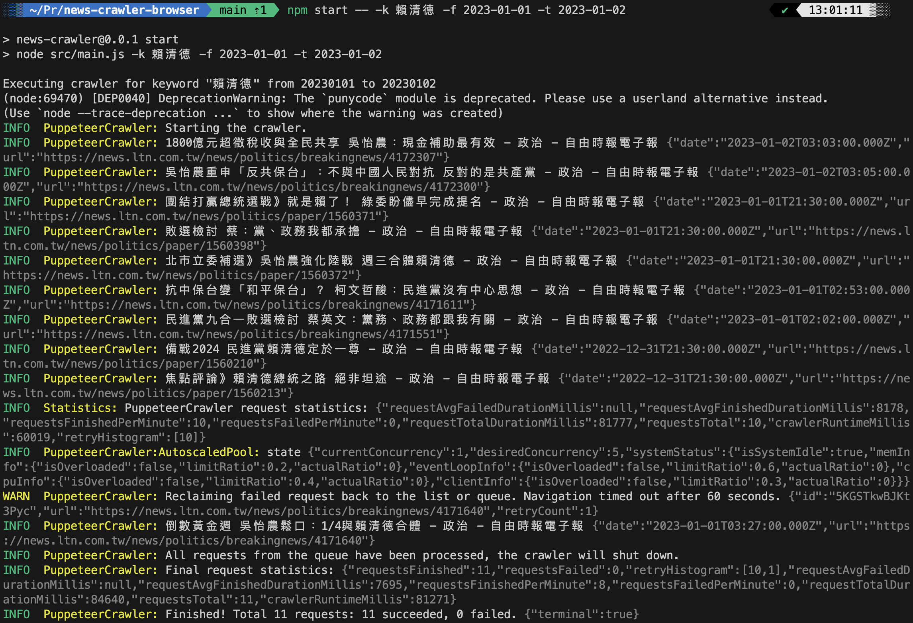

News Crawler
===

## Overview

The News Crawler project is a tool created for gathering news data from diverse sources. Whether you're interested in monitoring headlines, tracking trends, or analyzing news content, this project provides a flexible and efficient solution for scraping relevant information.

## Installation

Before using the News Crawler, make sure to install the required dependencies. Run the following commands to set up the necessary environment:

```bash
npm ci
npm run install:chromium
```

## Configuration

To use the News Crawler project, you need to configure your environment variables by creating a .env file in the project root directory. Below is an example .env.example file that you can use as a template. Copy this file to a new file named .env and fill in the necessary values.

```env
# Set to true if you want the crawler to run in headless mode (no browser UI).
CRAWLER_HEADLESS=true

# If using a custom Chromium executable path, provide the full path here.
CRAWLER_EXECUTABLE_PATH=
```

## Getting Started

To start the news data gathering process, execute the following command:

```bash
npm start -- --keyword 賴清德 --from 2023-01-01 --to 2023-01-31
```

## Data Storage

After executing the News Crawler with the provided command, the gathered news data will be stored in the `storage/datasets` directory. You can navigate to this directory to access the collected information.

## Demo


